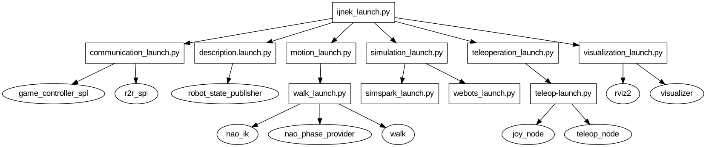

# 🚀 launch_graph

`launch_graph` is a ROS 2 tool that visualizes the structure of your launch files. It recursively finds included launch files and node actions, then generates a visual graph using Graphviz.



## 🔍 Usage

```bash
ros2 run launch_graph generate <path_to_launch_file.py>
```

This will generate a graph in the specified format using Graphviz.

| Argument           | Description                              | Default                |
| ------------------ | ---------------------------------------- | ---------------------- |
| `<launch_file.py>` | Path to the ROS 2 launch file to analyze | *(required)*           |
| `--format`         | Output format: `dot`, `pdf`, or `png`    | `png`                  |
| `--out`            | Output file name for the generated graph | `launch_tree.<format>` |
